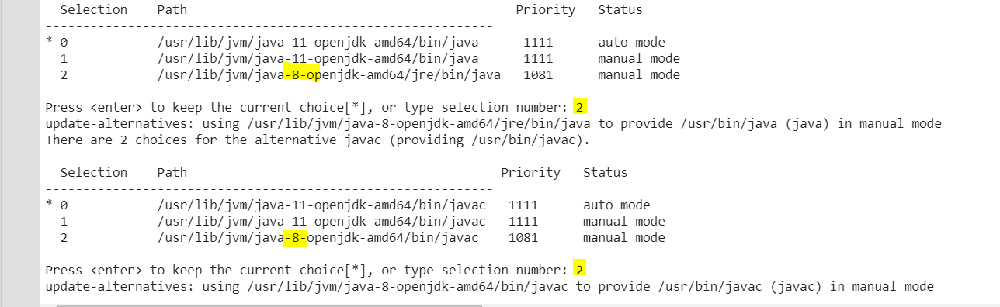

# Spark on GoogleColab
This is an example to how run Spark on Google Colab

If you want just the installation of Spark and put your own code go to PySpark_Colab_Example.ipynb

If you want a full example that you just have to press play go to ...

## Steps to run the example

1. Open the file *PySpark_Colab_Example.ipynb* or *PySpark_Colab_Example.ipynb* from Google Colab (via github). 

2. Run the code. In the install it will ask you wich Java and Javac version you want to use. 

As Spark runs with Java8 select java8, usually option 2. See Image bellow:

